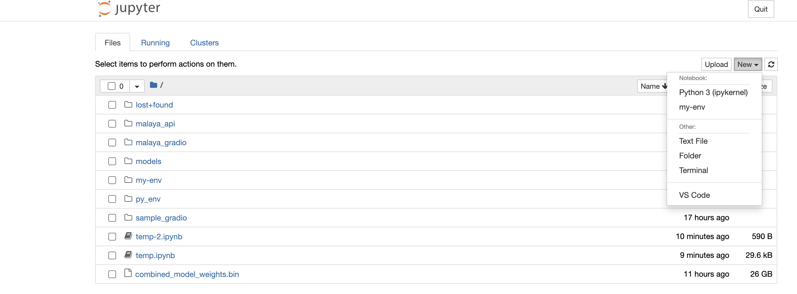

# Jupter Notebook with GPU

Jupyter Notebook with GPU and Code Server!

## Cloud environment

Current manifests only applicable for Azure Kubernetes Service and AWS EKS.

Why Kubernetes? Spot auto respawn!

Why domain is mesolitica.com? Because currently Malaysia-AI sponsored by mesolitica.com!

## Server access

protected using Github Oauth, private message @aisyahrzk, or @KamarulAdha or @Hazqeel09 to get access, they will do some background checking.

### Training server 

At https://jupyter.app.mesolitica.com, this server is to train the models and dataset preprocessing.

Currently we use https://learn.microsoft.com/en-us/azure/virtual-machines/nc-a100-v4-series

#### 1 GPU Server

Standard_NC24ads_A100_v4, 

1. 24 vCPU.
2. 220 GB RAM.
3. 1 A100 GPU 80GB VRAM.
4. Spot based.

#### 4 GPUs Server

Standard_NC96ads_A100_v4,

1. 96 vCPU.
2. 880 GB RAM.
3. 4 A100 GPU 80GB VRAM.
4. Spot based.

### Serve server

At https://jupyter-serve.app.mesolitica.com, this server is to serve the model using API and Chatbot interface.

1. 24 vCPU.
2. 220 GB RAM.
3. 1 A100 GPU 80GB VRAM.
4. Spot based.

## Auto restart script

Because the instance is spot based, so it can be killed any time (between 1 day - 6 days), so we have to prepare the script to auto respawn,

```bash
pm2 start "python3 /dir/script.py"
pm2 save
```

## Manual restart pod

Sometime GPU is not able detect for some reason, so we have to force restart the pod, to do it inside the pod,

```bash
kill -15 1
```

So this will kill Jupyter Notebook and force Kubernetes to restart the pod.

About GPU not able to detect, can read more at https://github.com/Azure/AKS/issues/3680

## Jupyter proxy

If you run any webserver inside jupyter server,

```python
from fastapi import FastAPI

app = FastAPI()

@app.get('/')
async def get():
    return 'hello'

import asyncio
import uvicorn

if __name__ == "__main__":
    config = uvicorn.Config(app)
    server = uvicorn.Server(config)
    await server.serve()
```

You can access the webserver at https://jupyter.app.mesolitica.com/proxy/{port}/

## VS code

Go to https://jupyter.app.mesolitica.com/vscode/


## How to create virtual environment

1. Open new terminal using Jupyter Terminal or VS Code.
2. Run these commands,

```bash
sudo apt install python3.10-venv -y
python3 -m venv my-env
~/my-env/bin/pip3 install wheel
~/my-env/bin/pip3 install ipykernel
~/my-env/bin/python3 -m ipykernel install --user --name=my-env
```

3. Feel free to change `my-env` to any name.
4. Go to Jupyter again, you should see your new virtual env,



5. To install libraries,

```bash
~/my-env/bin/pip3 install library
```

In terminal or jupyter cell.

## Building image

```bash
docker build -t mesoliticadev/jupyter-gpu-devel:main .
docker push mesoliticadev/jupyter-gpu-devel:main
```

## Rules

1. Respect each others, do not kill someone else processes.
2. Do not abuse for personal gains, eg, mining something.

